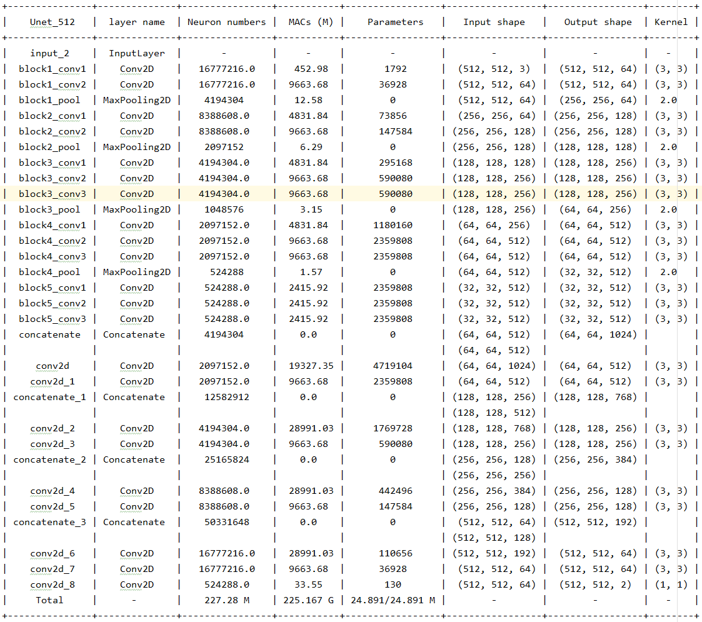

# Unet_Medical_Segmentation
This is an implementation of “U-Net: Convolutional Networks for Biomedical Image Segmentation” and "UNet++: A Nested U-Net Architecture for Medical Image Segmentation" in Python and powered by the Tensorflow2 deep learning framework. Unet family  has been proposed for a more precise segmentation on medical image.


---

### Unet and UNet++

UNet++ is a new general purpose image segmentation architecture for more accurate image segmentation. UNet++ consists of U-Nets of 
varying depths whose decoders are densely connected at the same resolution via the redesigned skip pathways, which aim to address 
two key challenges of the U-Net: 1) unknown depth of the optimal architecture and 2) the unnecessarily restrictive design of skip connections.

Following is a visual comparision of Unet (left) and Unet++ (right).

<table border="1" width="100%">
    <tr>
        <td></td>
        <td></td>
    </tr>
</table>

---
---

### Loss functions
- Sorence Dice
- Crossentropy
- F1
- Mean IoU


### Usage

Clone the repository and run the scripts with:

```python
    python3 train.py
```

Load the pretrained model from directory ``pretrained_models`` and run the prediction with 

```python
    python3 predict.py
```


### Some results


### Model summary

Unet

<p align="center">
      

